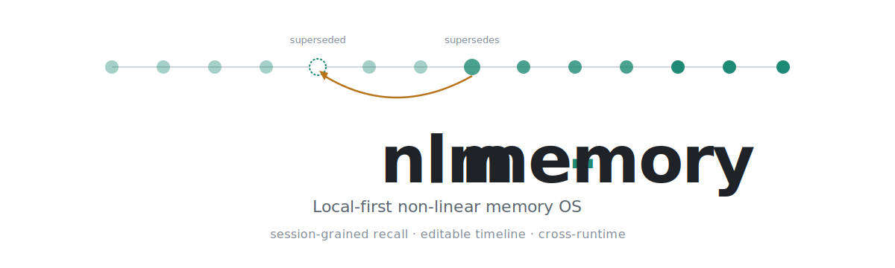

<p align="center">
  <picture>
    <source media="(prefers-color-scheme: dark)" srcset="assets/banner-dark.svg" />
    <source media="(prefers-color-scheme: light)" srcset="assets/banner-light.svg" />
    
  </picture>
</p>

<p align="center">
  <a href="https://www.npmjs.com/package/nlm-memory"></a>
  <a href="https://github.com/pbmagnet4/nlm-memory/actions/workflows/ci.yml"></a>
  <a href="https://github.com/pbmagnet4/nlm-memory/blob/main/LICENSE"></a>
  <a href="https://nodejs.org"></a>
  
  
  
  
</p>

<p align="center">
  <a href="#install">Install</a> &middot;
  <a href="#quick-start">Quick Start</a> &middot;
  <a href="#runtimes">Runtimes</a> &middot;
  <a href="#how-recall-works">How recall works</a> &middot;
  <a href="#agent-self-improvement-signals">Signals</a> &middot;
  <a href="#mcp-tools">MCP</a> &middot;
  <a href="#rest-api">REST API</a> &middot;
  <a href="#daily-digest">Digest</a> &middot;
  <a href="#configuration">Config</a> &middot;
  <a href="#security">Security</a> &middot;
  <a href="#vs-alternatives">vs Alternatives</a>
</p>

---

`nlm-memory` is a local-first memory layer for AI coding agents. It indexes every session from Claude Code, Codex, OpenCode, Cursor, Windsurf, Hermes, Aider, and pi into a single searchable store on your machine. Three properties no other memory layer ships together:

1. **Cross-runtime reach.** One index, every adapter.
2. **Editable timeline.** Sessions can be superseded by newer ones; entities can be retired. Patch history retroactively — no other tool lets you do this. See [docs/supersedence.md](docs/supersedence.md).
3. **97.2% R@5 baseline.** On a 14-month corpus, keyword recall surfaces the right session in the top 5 on 97.2% of evaluator queries. No fine-tuning. The labels were generated by DeepSeek V4 — the retrieval algorithm is the same code path you'll run, but expect a lower number with a smaller local classifier. See [docs/methodology-recall-baseline.md](docs/methodology-recall-baseline.md).

Everything stays on your machine by default. No telemetry, no account. The classifier defaults to local (Ollama); if you opt into a cloud classifier (DeepSeek, OpenAI, Anthropic, OpenRouter, or any OpenAI-compatible endpoint), session transcripts are sent to that provider — see [Security](#security) for the exact data-flow.

---

## Install

```sh
npm install -g nlm-memory
nlm setup
```

`nlm setup` is the interactive first-run wizard. It picks your classifier + model, wires the runtimes you actually use, generates an `NLM_MCP_TOKEN`, hardens permissions on `~/.nlm/`, and installs the daemon supervisor for your platform.

| Platform | Daemon | Notes |
|---|---|---|
| **macOS** | LaunchAgent at `~/Library/LaunchAgents/com.github.pbmagnet4.nlm-memory.plist` | Auto-starts on login |
| **Linux** | systemd user unit at `~/.config/systemd/user/nlm.service` | Headless servers: `loginctl enable-linger $USER` so the daemon survives logout |
| **Windows** | Manual `nlm start` for now | Hook + MCP install paths are platform-aware; supervisor lands next release |

Stop or remove: `nlm uninstall`.

---

## Quick Start

After `nlm setup` finishes, open **http://localhost:3940/ui** — the daemon is running. A 30-second sanity check:

```sh
nlm recall "what was that pgvector decision"   # one-shot search from the shell
nlm digest                                      # yesterday's activity at a glance
nlm --version
```

---

## Runtimes

One corpus across every adapter. MCP works against all nine. **Automatic context injection via hooks** ships on three (Claude Code, Hermes Agent, pi.dev); on the others the agent must call `recall_sessions` explicitly via MCP. `nlm connect` wires whichever surface the runtime supports:

| Runtime | Connect | Sessions read from | Hooks |
|---|---|---|---|
| **Claude Code** | `nlm connect claude-code` | `~/.claude/projects/**/*.jsonl` | 6 hooks: UserPromptSubmit, SessionStart, SessionEnd, Stop, PreCompact, SubagentStart |
| **Codex CLI** | `nlm connect codex` | `~/.codex/sessions/` | Marketplace plugin (UserPromptSubmit + Stop) |
| **Hermes** | `nlm connect hermes` | `~/.hermes/sessions/` | MCP only |
| **Hermes Agent** | `nlm connect hermes-agent` | `~/.hermes/state.db` | 6 hooks: pre_llm_call, post_llm_call, on_session_start/end/finalize/reset |
| **Cursor** | `nlm connect cursor` | Cursor IDE chat DB | MCP only |
| **Windsurf** | `nlm connect windsurf` | Windsurf user dir | MCP only |
| **OpenCode** | adapter active | `~/.local/share/opencode/` | MCP only |
| **Aider** | adapter active | `AIDER_CHAT_HISTORY_FILE` | MCP only |
| **pi.dev** | `nlm setup` (auto) or `nlm connect pi` | `~/.pi/agent/sessions/**/*.jsonl` | 1 hook: input (prepend via transform) |

`nlm disconnect <runtime>` reverses any of the above.

---

## How recall works

Two delivery paths. They share the same index.

### 1. Hooks — automatic context injection

Hooks fire on user input and prepend a pointer block of likely-relevant prior sessions to the model's context. Three runtimes ship hooks today: Claude Code (six-hook lifecycle), Hermes Agent (six parallel hooks), and pi.dev (one `input` hook via [nlm/](nlm/README.md)). On all other runtimes the agent calls `recall_sessions` explicitly via MCP. Full lifecycle, modes, logging surface, and the daily liveness canary documented in [docs/hooks.md](docs/hooks.md).

**Claude Code** — six hooks written to `~/.claude/settings.json` via `nlm connect claude-code`:

| Event | What NLM does | Mode |
|---|---|---|
| **UserPromptSubmit** | Score the prompt, silently prepend pointer block listing 0–3 most likely-relevant prior sessions | live by default |
| **SessionStart** | Cold-start agents (cron, background) hit this; same pointer-block delivery without a user prompt | live by default |
| **SessionEnd** | Delete the per-conversation memo on session close so state files don't accumulate | always on |
| **Stop** | Scan the model's response for citations of surfaced session IDs → updates `useful_hit_rate` and builds the reranker training substrate | always on |
| **PreCompact** | Flush the per-conversation surfaced-IDs memo so post-compaction recalls aren't gated | always on |
| **SubagentStart** | Record parent→subagent links so threads stay coherent across dispatches | always on |

**Hermes Agent** — six hooks installed to `~/.hermes/plugins/nlm-memory/` via `nlm connect hermes-agent`. All calls are fire-and-forget except `pre_llm_call`, which returns a context string for injection:

| Hook | What NLM does | Blocks turn? |
|---|---|---|
| **pre_llm_call** | POST prompt to daemon → inject pointer block of relevant prior sessions into context | yes (returns context string) |
| **post_llm_call** | POST assistant response to daemon → citation scan, `useful_hit_rate` update | no |
| **on_session_start** | Signal session open → daemon initialises per-session memo | no |
| **on_session_end** | Signal session close → daemon flushes memo | no |
| **on_session_finalize** | Signal transcript finalised → triggers async classifier run | no |
| **on_session_reset** | Signal session reset → daemon clears per-session state | no |

**pi.dev** — one `input` hook registered via `nlm connect pi`. Pi's extension API only exposes `input`, so transcript ingestion is handled separately by the passive adapter scanning `~/.pi/agent/sessions/`:

| Hook | What NLM does | Blocks turn? |
|---|---|---|
| **input** | Score user message → if relevant sessions found, prepend pointer block to the prompt text via `{ action: "transform" }` | yes (returns transformed text) |

All three fail-open: any daemon error yields a clean exit and never blocks the model. Switch Claude Code hooks to **shadow** mode (log-only, no injection) with `NLM_HOOK_MODE=shadow`.

### 2. MCP — explicit tools any agent can call

Container-hosted agents (Hermes WebUI, Codex CLI, etc.) hit the Streamable-HTTP `POST /mcp` endpoint with `Authorization: Bearer ${NLM_MCP_TOKEN}`. Stdio MCP is also supported for Claude Code via `~/.mcp.json`.

---

## Agent self-improvement signals

NLM can ingest structured feedback events (`nlm.signal`) from any tool in your agent stack -- quality gates, eval runners, code reviewers, test harnesses -- and surface the aggregated failure patterns back to the agent at session start. Over time the agent learns which steps tend to fail for a given repo and model, without any external service.

### Payload contract

```jsonc
{
  "v": 1,
  "kind": "gate" | "eval" | "review" | "test",  // required
  "outcome": "pass" | "fail" | "fix" | "exhausted",  // required
  "producer": "quality-gate",   // defaults to "unknown"
  "model": "qwen3-coder",       // defaults to "unknown"
  "repo": "/path/or/name",      // defaults to "unknown"
  "detail": { "step": "types", "files": ["a.ts"], "attempt": 2 },
  "session": "<session-id-if-known>",
  "ts": "2026-06-09T18:00:00.000Z"  // defaults to now
}
```

`kind` and `outcome` are the only required fields; invalid values are rejected with `400`. `install_scope` is stamped server-side -- do not send it.

### Transports

**HTTP (any producer)**

```js
await fetch("http://localhost:3940/api/signal", {
  method: "POST",
  headers: { "content-type": "application/json" },
  body: JSON.stringify({
    kind: "gate", producer: "my-tool", outcome: "fail",
    model, repo, detail: { step: "types" }, ts: new Date().toISOString(),
  }),
});
```

Rides the standard `/api/*` loopback gate. When the daemon runs with `NLM_UI_AUTH=cookie`, send `Authorization: Bearer $NLM_MCP_TOKEN`.

**Session-embedded (pi.dev)**

Pi producers call `pi.appendEntry("nlm.signal", payload)` inside an extension. This writes:

```json
{ "type": "custom", "customType": "nlm.signal", "data": { ...payload } }
```

to the session `.jsonl`. NLM's pi adapter recognises the `nlm.signal` customType and the scheduler drains it during normal ingest -- no HTTP call required.

### Failure-mode recall

NLM aggregates signals into failure modes per `(repo, model)` pair. A mode surfaces when its fail-rate reaches 20% or higher over at least 10 events in a trailing 14-day window. At session start the Claude Code `SessionStart` hook injects a "Known failure modes for this repo" block into the agent prompt automatically (repo-scoped). Any harness can fetch the same data directly:

```
GET /api/signals/failure-modes?repo=<repo>&model=<model>
```

### Inspection

```sh
nlm improve   # prints failure modes + recommendations for the current repo
```

The UI **Recall** page also has a failure-modes panel. NLM surfaces findings and recommendations only -- it never acts on them.

### Configuration and privacy

| Var | Default | What |
|---|---|---|
| `NLM_SIGNALS_ENABLED` | `1` (on) | Set to `0` to disable signal ingest entirely |
| `NLM_SIGNAL_RETENTION_DAYS` | `90` | Raw signals older than this are pruned |

Signals are local-only. They are stamped with a per-install ID from `~/.nlm/install-id` and never leave the machine.

### Reference producer

The pi `quality-gate` extension (in the `pi-sandbox` repo) is a ~10-line integration that emits `nlm.signal` per gate step and again on retry exhaustion. It is the canonical example of the session-embedded transport.

---

## MCP Tools

| Tool | What it does |
|---|---|
| `recall_sessions` | Hybrid keyword+semantic search across the full session corpus. Returns label, started_at, snippet, match score. |
| `get_session` | Full body of one session by ID. Includes enriched `supersedes` / `supersededBy` links (id + label + summary) so chasing corrected facts doesn't need a second round-trip. |
| `recall_facts` | Search structured facts: decisions, open questions, project state. Filterable by entity and kind. |
| `get_fact_history` | Full version history of one fact — how a decision evolved over time. |
| `cite_session` | Mark a session as explicitly referenced. Drives the `useful_hit_rate` metric and the future learned reranker. |
| `mark_superseded` | Retroactively retire a stale session and point it at the newer one that replaces it. The editable-timeline write path — see [docs/supersedence.md](docs/supersedence.md). |

---

## REST API

Daemon binds `127.0.0.1:3940` (override with `NLM_PORT`). Selected endpoints:

| Method | Path | Auth | Purpose |
|---|---|---|---|
| GET | `/api/health` | Host-only | Liveness probe; returns `{version, status, service}` |
| GET | `/api/recall` | Bearer/Origin | Hybrid recall — `?q=`, `?mode=keyword\|semantic\|hybrid`, `?limit=` |
| GET | `/api/recall/stats` | Bearer/Origin | 7-day stats: total, hit_rate, useful_hit_rate, top queries |
| GET | `/api/recall/recent` | Bearer/Origin | Last N recall events for live tail/telemetry |
| GET | `/api/recall/cite-stats` | Bearer/Origin | Citation rate over `?days=` |
| GET | `/api/session/:id` | Bearer/Origin | Full session body + supersedence links |
| GET | `/api/recall/facts` | Bearer/Origin | Structured fact search |
| GET | `/api/facts/history` | Bearer/Origin | Version chain for one fact |
| GET | `/api/dataset` | Bearer/Origin | Full session list for the UI dataset view |
| GET | `/api/live/recent-writes` | Bearer/Origin | Live tail of ingested sessions |
| GET | `/api/data/backup` | Bearer/Origin | Streaming SQLite snapshot download |
| POST | `/api/data/restore` | Bearer/Origin | Stage a snapshot for apply-on-restart |
| POST | `/api/hook/pre-compact` | Bearer/Origin | Hook endpoint; flushes the surfaced-IDs memo |
| ALL | `/mcp` | Bearer required | Streamable-HTTP MCP transport for container agents |

`/api/*` is gated by three layers: 127.0.0.1 Host check (defeats DNS rebinding), Origin check when the browser sends one (defeats cross-origin drive-by), Bearer fallback when Origin is absent (server-to-server clients).

---

## Daily digest

Once-a-day summary of yesterday's activity:

```sh
nlm digest                  # print to stdout
nlm digest --telegram       # post to Telegram (TELEGRAM_BOT_TOKEN + TELEGRAM_CHAT_ID)
```

Reports 24h real-traffic (probes filtered), 7d hit_rate + useful_hit_rate, top 5 queries, and a **`WARN hook silent`** alert when Claude Code ran yesterday but no live hook fires were logged. That alert is the canary for post-install drift — node upgrades, `settings.json` hand-edits, and `dist/` moves silently break the hook while Claude Code keeps working. Setup-time smoke tests can't catch this; only the daily correlation can.

Wire to cron for a morning push:

```cron
0 7 * * *  nlm digest --telegram >> ~/.nlm/logs/digest.log 2>&1
```

When the daemon is unreachable, `--telegram` still fires — posts a "daemon unreachable" alert instead of failing silently.

---

## What's inside the UI

Open `http://localhost:3940/ui` after the daemon starts.

| Page | What it shows |
|---|---|
| **Live** | Sessions being written in real time, recent reads, recent decisions |
| **Pulse** | System health — coherence, runtimes, stale entities, recent sessions |
| **River** | Full session timeline with density controls + superseded-lane visualization |
| **Thread** | Per-entity conversation history with runtime filters and ←/→ navigation |
| **Search** | Keyword, semantic, or hybrid recall with match snippets and field-origin tags |
| **Recall** | Adoption telemetry — useful_hit_rate, source breakdown, query log |
| **Settings** | Sources, providers, classifier, data backup/restore |

---

## Pipeline

What happens when an AI runtime writes a session and you later recall it:

```
ingest:  runtime transcript (jsonl/sqlite)
   -> adapter parses runtime-specific format
   -> classifier (Ollama local by default; DeepSeek / OpenAI / Anthropic / OpenRouter / OpenAI-compatible if you opt in) extracts label + entities + decisions + open questions
   -> embedder (nomic-embed-text via Ollama) computes 768-dim vector
   -> SQLite canonical store + FTS5 keyword index + sqlite-vec ANN index

recall: prompt / query
   -> tokenize + match scoring (label x3, entity-exact x4, decision x2, summary x1, phrase-bonus +5)
   -> hybrid: BM25-style keyword + vector cosine, fused by score
   -> select-top-N gate (per-fire cap 3, per-conversation cap 10)
   -> pointer block prepended to model context (hooks) or returned as tool result (MCP)
```

---

## Configuration

### Environment variables

| Var | Default | What |
|---|---|---|
| `NLM_PORT` | `3940` | Daemon bind port (loopback only) |
| `NLM_DB_PATH` | `~/.nlm/canonical.sqlite` | SQLite canonical store location |
| `NLM_HOOK_MODE` | `live` | `live` injects pointer block; `shadow` logs without injecting |
| `NLM_HOOK_LOG` | `~/.nlm/hook-log.jsonl` | Hook fire log; powers digest's liveness alert |
| `NLM_USEFUL_HIT_LOG` | `~/.nlm/useful-hit-log.jsonl` | Citation/useful-hit ledger |
| `NLM_QUERY_LOG` | `~/.nlm/query-log.jsonl` | Recall query telemetry |
| `NLM_CITATION_LOG` | `~/.nlm/citation-log.jsonl` | Stop-hook citation events |
| `NLM_MCP_TOKEN` | auto-generated | 256-bit bearer for `/api/*` (non-browser) and `/mcp` |
| `NLM_MCP_CONFIG` | `~/.mcp.json` | Path the `connect`/`disconnect` commands modify |
| `NLM_CLASSIFIER` | `ollama` | `ollama` (local, default), `deepseek`, `openai`, `anthropic`, `openrouter`, or `openai-compatible` |
| `NLM_CLASSIFIER_MODEL` | `phi4-mini:latest` | Model id for the chosen provider |
| `NLM_OLLAMA_URL` | `http://localhost:11434` | Override Ollama endpoint |
| `NLM_ADAPTERS` | all | Comma-separated allowlist of adapters to enable |
| `DEEPSEEK_API_KEY` | — | Required only when classifier=deepseek |
| `NLM_DISABLE_UPDATE_CHECK` | — | Set to `1` to disable the daily npm-registry update check |
| `TELEGRAM_BOT_TOKEN` / `TELEGRAM_CHAT_ID` | — | Required for `nlm digest --telegram` |

### Changing the classifier from the UI

The CLI env-vars above are one path; the running UI is the other. **Settings → Providers** is a full CRUD list of LLM endpoints (Ollama, DeepSeek, OpenAI, Anthropic, OpenRouter, or any OpenAI-compatible endpoint such as LM Studio, llama.cpp, vLLM, text-generation-webui). Click **Add provider**, point it at your local server, hit **Save & test**. Then in **Settings → Classifier**, pick that provider and model. No env-var editing required, and the DeepSeek row can be disabled or deleted from the same screen.

Adapter source paths can be overridden individually: `NLM_CLAUDE_PROJECTS_PATH`, `NLM_CODEX_CONFIG`, `NLM_CURSOR_DB_PATH`, `NLM_HERMES_SESSIONS_PATH`, `NLM_HERMES_AGENT_DB_PATH`, `NLM_WINDSURF_USER_DIR`, `OPENCODE_DB_PATH`, `PI_SESSIONS_PATH`, `AIDER_CHAT_HISTORY_FILE`.

### Config file

`~/.nlm/.env` — autoloaded by every CLI command. Mode `0600`, owned by you, never readable by other users. The setup wizard writes the initial keys; you can edit it directly.

### Ports

| Port | Process | Bind | Override |
|---|---|---|---|
| `3940` | Daemon HTTP API + MCP | `127.0.0.1` only | `NLM_PORT` |
| `11434` | Ollama (embedding + local classifier) | localhost | `NLM_OLLAMA_URL` |

---

## Security

NLM is local-first by design, but "local-first" is not "local-only" — read this section before picking a classifier.

**Daemon hardening (always on):**

- Binds to `127.0.0.1` only — never `0.0.0.0`
- Enforces Host + Origin checks on `/api/*` to defeat DNS rebinding and cross-origin drive-by
- Generates a 256-bit `NLM_MCP_TOKEN` on first run, persists to `~/.nlm/.env` (mode `0600`); non-browser clients authenticate with `Authorization: Bearer ${NLM_MCP_TOKEN}` compared with `timingSafeEqual`
- Recursively enforces `0700` on `~/.nlm/` and `0600` on its contents on every start
- Optional opt-in UI cookie auth (`NLM_UI_AUTH=cookie`) with HMAC-derived cookie value and nonce-based bootstrap (token never appears in a URL)

**Outbound network traffic — exhaustive list:**

| Destination | When | What data leaves |
|---|---|---|
| Configured classifier endpoint | Every new session is classified | Up to ~30K chars of the session transcript (prompts, responses, code snippets — whatever is in the transcript). If the classifier is **Ollama (default)** the destination is `localhost:11434` and nothing leaves the machine. If you opted into DeepSeek / OpenAI / Anthropic / OpenRouter / any OpenAI-compatible endpoint, the transcript is POSTed to that vendor. |
| Ollama `localhost:11434` | Every new session | 768-dim embedding request (local) |
| `registry.npmjs.org` | Once per 24h | Anonymous `GET /nlm-memory/latest` for update notifications. Cached at `~/.nlm/update-check.json`. Disable with `NLM_DISABLE_UPDATE_CHECK=1`. |
| `api.telegram.org` | Only when `nlm digest --telegram` is invoked | Digest content |
| AI runtime transcript files | Continuous | Read-only filesystem reads |

No analytics SDK. No crash reporter. No vendor ping beyond the four rows above.

**Honest caveats — known limitations:**

- **Cloud-classifier data egress.** A "cloud" classifier (DeepSeek, OpenAI, Anthropic, OpenRouter) by definition sees your session content. Anything pasted into a transcript — API keys, client names, internal URLs — is sent to that vendor under their data-use terms. The setup wizard warns you before you pick one. The default is Ollama for this reason.
- **Provider API keys are stored in plaintext in SQLite today** (`providers.api_key`, in `~/.nlm/canonical.sqlite`). The file is `0600`, in a `0700` directory, owned by your user — so any process running as your user can read it. OS-keychain migration is on the roadmap; until then, treat the SQLite file like a `.env` file.
- **The classifier is fed untrusted indexed content.** Sessions written by AI runtimes can contain prompt-injection attempts. The classifier output is structured (label, entities, decisions, open questions) and never executed, but if you wire NLM to an agent that *acts* on classifier output, model that as untrusted input.
- **The hook fails open.** Any error in the recall hook yields a clean exit so it can't block your model. This means a silently-broken hook is possible — the daily digest's `WARN hook silent` canary is the detection path.

Report vulnerabilities via [SECURITY.md](SECURITY.md).

### Remote access

The daemon binds to `127.0.0.1`. If you want to reach the UI from another device — phone, second laptop — don't change the bind. Put a tunnel in front instead.

**Tailscale (recommended for personal use).** Run once on the daemon host:

```sh
tailscale serve --bg http://localhost:3940
```

Then visit `https://<machine>.<tailnet>.ts.net/ui/` from any tailnet device. Tailscale Serve rewrites the upstream `Host` header to `localhost:3940`, so the loopback check passes without any nlm-memory config. WireGuard + your tailnet ACLs are the auth layer — for a single-user tailnet this is strictly stronger than `NLM_UI_AUTH=cookie`, so leave that off.

**If you do enable `NLM_UI_AUTH=cookie`** (defense in depth, or you've added untrusted devices to your tailnet), bootstrapping a cookie from a remote device needs one extra step. `nlm ui` only opens a browser on the daemon host; for the remote browser:

```sh
ssh <daemon-host> 'nlm ui --print'   # mints a nonce, prints the URL
# Paste the URL into the remote browser within ~60s (nonce TTL)
```

**Do not expose the daemon directly to the public internet.** The cookie is a shared-HMAC speed bump, not real public-internet auth. If you absolutely must, put it behind something with real authentication (Cloudflare Access, Tailscale Funnel with auth in front, etc.).

---

## Upgrading from v0.4.x

```sh
npm update -g nlm-memory
```

Old installs have `NLM_HOOK_MODE=shadow` hardcoded in `~/.claude/settings.json` — shadow mode is silent, so re-run `nlm hook install` to switch to live recall injection. Permissions and `NLM_MCP_TOKEN` self-heal on the next `nlm start`.

---

## vs Alternatives

| | **nlm-memory** | mem0 | Letta / MemGPT | Built-in (`CLAUDE.md`) |
|---|---|---|---|---|
| **Unit of memory** | Whole session + extracted markers | Atomic facts | Graph nodes + edges | Static file |
| **Cross-runtime** | 9 adapters, one corpus | Per-app SDK integration | Per-app SDK integration | Per-runtime config |
| **Editable timeline** | Sessions can be superseded, retired, aborted | Append-only fact log | Graph edits | Manual file edits |
| **R@5 baseline** | 97.2% on 14mo corpus | published varies | published varies | n/a |
| **External deps** | SQLite + Ollama (local) | Postgres or Qdrant | Postgres | none |
| **Hosted offering** | none — local only | yes | yes | n/a |
| **Account required** | none | yes (cloud tier) | yes | none |
| **Telemetry** | none | yes | yes | none |
| **License** | Apache 2.0 | Apache 2.0 | Apache 2.0 | — |

The defining property is the editable timeline. mem0 and Letta append; NLM lets you reach back and mark a session as superseded by a newer one, retire one as no-longer-relevant, or flag one as aborted-mid-flight. The next recall surfaces the corrected version, not the stale one. A claim from 6 months ago can be patched today.

---

## Docs

- [docs/supersedence.md](docs/supersedence.md) — the editable timeline: statuses, what gets recorded when, how supersedence flows through recall
- [docs/hooks.md](docs/hooks.md) — full hook lifecycle, modes, selection logic, pointer-block format, logging surface, daily liveness canary
- [docs/methodology-recall-baseline.md](docs/methodology-recall-baseline.md) — how R@5 = 97.2% is measured + how to run LongMemEval-S on your own machine
- [SECURITY.md](SECURITY.md) — threat model + responsible disclosure

---

## Development

```sh
git clone https://github.com/pbmagnet4/nlm-memory
cd nlm-memory
npm install
npm run build          # compile dist/ — commit the result, it ships in the repo
npm run dev            # hot-reload daemon
npm run ui:dev         # hot-reload UI at localhost:5173 (proxies /api to :3940)
npm test               # 726 tests across 73 files
npm run typecheck
```

Architecture: hexagonal. `src/core/` knows about ports (interfaces), not adapters. `src/cli/nlm.ts` is the composition root — the only file that wires concrete implementations (`SqliteSessionStore`, `OllamaClient`, `Hono`, `StdioServerTransport`). Adapters in `src/core/adapters/` are one-way: they parse runtime-specific session formats into NLM's canonical shape; nothing in the runtime sees NLM.

`dist/` is built on install via the `prepare` script (runs automatically on `npm install` from git or registry) and packed into the published tarball via the `files` field. Not tracked in git.

---

## License

Apache 2.0 — see [LICENSE](LICENSE).
